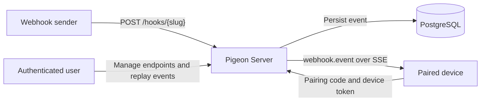

# Pigeon Server

Pigeon is a webhook relay for local and connected devices. It receives webhook
requests at stable endpoint URLs, stores each event in PostgreSQL, and pushes
new events to paired devices over Server-Sent Events (SSE).

This repository contains the Go API server for authentication, endpoint
management, device pairing, webhook ingestion, event replay, and live delivery.

## How It Works



1. An authenticated user creates an endpoint.
2. Pigeon assigns the endpoint a public webhook slug.
3. The user generates a short-lived pairing code for a device.
4. The device exchanges that code for a device token and connects to `/stream`.
5. Each webhook is stored and pushed to connected devices paired with that
   endpoint.

## Prerequisites

- [Go 1.26.3](https://go.dev/)
- [PostgreSQL](https://www.postgresql.org/)
- [Redis](https://redis.io/)
- Optional: a GitHub OAuth App for browser sign-in
- Optional: an OTLP-compatible collector for traces and metrics

PostgreSQL and Redis must be reachable when the server starts. Database tables
are created and updated automatically with GORM auto-migration.

## Quick Start

### 1. Prepare PostgreSQL and Redis

Create the development database:

```bash
createdb pigeon
```

Start Redis using your local installation or container runtime:

```bash
docker run --name pigeon-redis --rm -d -p 6379:6379 redis:7
```

### 2. Configure the Server

```bash
cp .env.example .env
make generate:key
```

`make generate:key` prints a secure `APP_KEY` assignment. Replace the
placeholder `APP_KEY` in `.env` with the generated value, then update the
database and Redis settings if they differ from the local defaults.

### 3. Run the API

```bash
go run ./cmd/server
```

The example configuration starts the server at `http://localhost:18080`.

Verify it is healthy:

```bash
curl http://localhost:18080/healthz
```

```json
{
  "message": "Success",
  "data": {
    "status": "ok"
  }
}
```

## GitHub OAuth

Create an OAuth App under
**GitHub Settings > Developer settings > OAuth Apps**. For the default local web
client, use:

```text
Homepage URL: http://localhost:3000
Authorization callback URL: http://localhost:3000/auth/callback
```

Set the credentials in `.env`:

```dotenv
GITHUB_CLIENT_ID=your-client-id
GITHUB_CLIENT_SECRET=your-client-secret
WEB_APP_URL=http://localhost:3000
```

The browser authentication flow is:

1. The web client requests `GET /auth/github` with optional `redirect_uri` and
   `state` query parameters.
2. Pigeon returns the GitHub authorization URL.
3. GitHub redirects the browser to the web client's `/auth/callback` page.
4. The web client sends the authorization `code` and matching `redirect_uri` to
   `POST /auth/github/exchange`.
5. Pigeon returns a signed bearer access token and the authenticated user.

The API does not expose an OAuth callback route. It trusts
`WEB_APP_URL/auth/callback` automatically. Add other exact callback URLs to the
comma-separated `OAUTH_REDIRECT_ALLOWLIST`; all other redirect URIs are
rejected.

Browser CORS requests are allowed only from the exact `WEB_APP_URL` origin.
Pigeon accepts `Authorization`, `Content-Type`, and `X-Pigeon-Device-Token`
headers from that origin.

Generating a login URL requires `GITHUB_CLIENT_ID`; exchanging an authorization
code requires both GitHub credentials. Missing required credentials return
`503 auth.github_not_configured`.

User access tokens are self-contained JWTs signed with `APP_KEY`. Calling
`POST /auth/logout` returns `204 No Content`, but does not revoke an issued
token; clients must remove their local token. The token remains valid until its
configured expiry.

## End-to-End Webhook Flow

The examples below assume the server is running and GitHub OAuth has produced a
user access token.

Set the base URL and token:

```bash
export PIGEON_URL=http://localhost:18080
export USER_TOKEN=replace-with-user-access-token
```

### 1. Create an Endpoint

```bash
curl -X POST "$PIGEON_URL/endpoints" \
  -H "Authorization: Bearer $USER_TOKEN" \
  -H "Content-Type: application/json" \
  -d '{"name":"Local checkout"}'
```

The response contains the endpoint `id` and generated `slug`:

```json
{
  "message": "Success",
  "data": {
    "id": "replace-with-endpoint-id",
    "name": "Local checkout",
    "slug": "local-checkout-replace",
    "is_active": true,
    "created_at": "2026-06-10T10:00:00Z",
    "updated_at": "2026-06-10T10:00:00Z"
  }
}
```

Use those values in the remaining commands:

```bash
export ENDPOINT_ID=replace-with-endpoint-id
export ENDPOINT_SLUG=local-checkout-replace
```

### 2. Generate a Pairing Code

```bash
curl -X POST "$PIGEON_URL/endpoints/$ENDPOINT_ID/pairing-codes" \
  -H "Authorization: Bearer $USER_TOKEN"
```

Pairing codes expire after 10 minutes and can only be used once.

```bash
export PAIRING_CODE=replace-with-pairing-code
```

### 3. Pair a Device

```bash
curl -X POST "$PIGEON_URL/devices/pair" \
  -H "Content-Type: application/json" \
  -d "{
    \"code\": \"$PAIRING_CODE\",
    \"device_id\": \"local-checkout-01\",
    \"device_name\": \"Local Checkout\"
  }"
```

The response contains a device record ID and a device token. Store the token
when it is issued; authenticated device requests require it.

```bash
export DEVICE_TOKEN=replace-with-device-token
```

### 4. Connect to the Event Stream

In one terminal, connect the paired device:

```bash
curl -N "$PIGEON_URL/stream" \
  -H "X-Pigeon-Device-Token: $DEVICE_TOKEN"
```

The stream starts with a connection comment:

```text
: connected
```

### 5. Send a Webhook

In another terminal:

```bash
curl -X POST "$PIGEON_URL/hooks/$ENDPOINT_SLUG?source=readme" \
  -H "Content-Type: application/json" \
  -H "X-Example-Signature: demo" \
  -d '{"order_id":"ord_123","status":"paid"}'
```

Pigeon returns the stored event ID. The connected device receives an SSE event
named `webhook.event` containing the request method, path, headers, query,
body, content type, and receipt time:

```text
event: webhook.event
data: {"event_id":"...","endpoint_id":"...","method":"POST","path":"/hooks/local-checkout-replace","headers":{...},"query":{"source":["readme"]},"body":"{\"order_id\":\"ord_123\",\"status\":\"paid\"}","content_type":"application/json","received_at":"2026-06-10T10:05:00Z"}
```

Stored events can be inspected through `GET /events/{id}` and pushed to
currently connected devices again through `POST /events/{id}/replay`.

## Authentication

Pigeon has two independent authentication modes:

| Principal | Authentication | Used for |
| --- | --- | --- |
| User | `Authorization: Bearer <access-token>` | Profile, endpoints, endpoint device lists, stored events, and replay |
| Device | `Authorization: Bearer <device-token>` or `X-Pigeon-Device-Token: <device-token>` | Heartbeats, device self-management, and SSE |

Webhook ingestion at `POST /hooks/{slug}`, device pairing at
`POST /devices/pair`, the health check, and the GitHub OAuth entry points do not
require an existing bearer token.

## API Overview

| Area | Routes |
| --- | --- |
| Health | `GET /healthz` |
| Authentication | `GET /auth/github`, `POST /auth/github/exchange`, `POST /auth/logout`, `GET /me` |
| Endpoints | Create, list, read, update, and delete `/endpoints`; generate pairing codes; list endpoint devices and events |
| Devices | Pair a device, send heartbeats, update the authenticated device, and delete it |
| Webhooks and events | Receive `POST /hooks/{slug}`, inspect events, and replay events |
| Live delivery | Connect an authenticated device to `GET /stream` |

Import
[`pigeon-server.postman_collection.json`](./pigeon-server.postman_collection.json)
for a route-level local API collection. Replace its authentication values with
fresh tokens from your environment.

## Response Format

Successful JSON responses use:

```json
{
  "message": "Success",
  "data": {}
}
```

Errors use a stable machine-readable code:

```json
{
  "message": "Validation failed",
  "code": "validation.failed",
  "errors": {
    "name": "Name is required"
  }
}
```

Endpoints that intentionally return no body use `204 No Content`.

## Configuration

Configuration is read from the environment. A local `.env` file is loaded
automatically when present.

| Variable | Default | Description |
| --- | --- | --- |
| `APP_NAME` | `pigeon` | Application name |
| `APP_ENV` | `development` | Runtime environment label |
| `APP_PORT` | `8080` | HTTP listen port; `.env.example` sets `18080` |
| `SERVICE_NAME` | `pigeon-server` | OpenTelemetry service name |
| `APP_KEY` | `development-app-key-change-me` | Secret used to sign user access tokens |
| `DB_HOST` | `localhost` | PostgreSQL host |
| `DB_PORT` | `5432` | PostgreSQL port |
| `DB_USER` | `postgres` | PostgreSQL user |
| `DB_PASSWORD` | `postgres` | PostgreSQL password |
| `DB_NAME` | `pigeon` | PostgreSQL database |
| `DB_SSLMODE` | `disable` | PostgreSQL SSL mode |
| `REDIS_HOST` | `localhost` | Redis host |
| `REDIS_PORT` | `6379` | Redis port |
| `REDIS_PASSWORD` | Empty | Redis password |
| `REDIS_DB` | `0` | Redis database number |
| `GITHUB_CLIENT_ID` | Empty | GitHub OAuth client ID |
| `GITHUB_CLIENT_SECRET` | Empty | GitHub OAuth client secret |
| `WEB_APP_URL` | `http://localhost:3000` | Trusted web origin and default OAuth callback base |
| `OAUTH_REDIRECT_ALLOWLIST` | Empty | Additional exact OAuth callback URLs, comma-separated |
| `AUTH_ACCESS_TOKEN_TTL` | `1h` | User access token lifetime as a Go duration |
| `OTEL_EXPORTER_OTLP_ENDPOINT` | Empty | OTLP gRPC collector endpoint |

Use a strong, unique `APP_KEY` outside development. `WEB_APP_URL` must be an
absolute HTTP or HTTPS origin without a path, query string, credentials, or
fragment.

## Observability

Requests are logged as structured JSON with method, path, status, duration, and
request ID. HTTP requests are instrumented with OpenTelemetry.

Set `OTEL_EXPORTER_OTLP_ENDPOINT` to enable OTLP gRPC trace and metric export.
When it is empty, Pigeon runs without exporters.

## Project Structure

```text
cmd/server/       Application entrypoint and graceful shutdown
config/           Environment-backed configuration
infra/            PostgreSQL, Redis, and OpenTelemetry setup
internal/app/     Application wiring, routes, and HTTP middleware
internal/domain/  Auth, endpoint, event, device, and push behavior
pkg/              Shared errors, responses, tokens, and clock utilities
```

The live SSE hub is currently in memory. A running server delivers events to
devices connected to that same process; PostgreSQL remains the source of truth
for stored events and delivery logs.

## Testing

Run the complete test suite:

```bash
go test ./...
```

## License

Pigeon Server is available under the [MIT License](./LICENSE).
